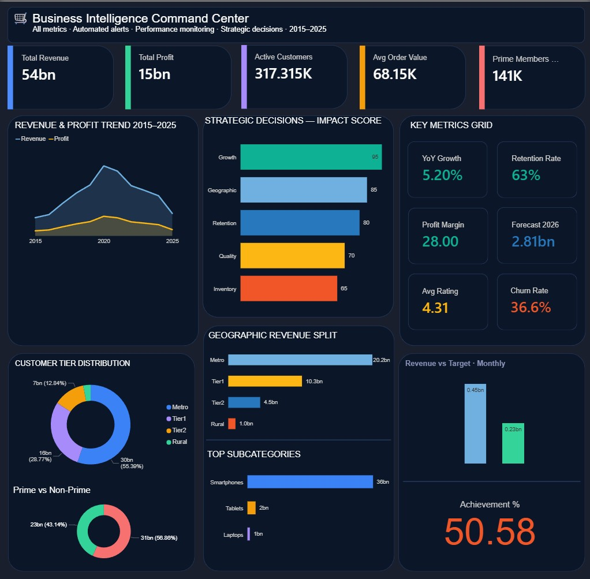
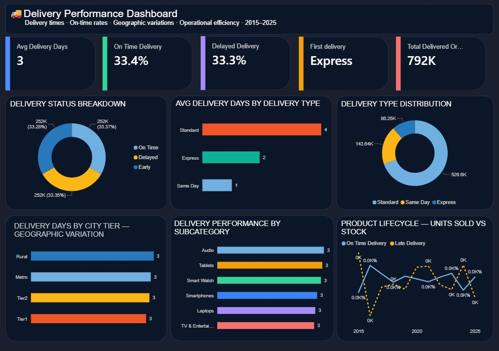
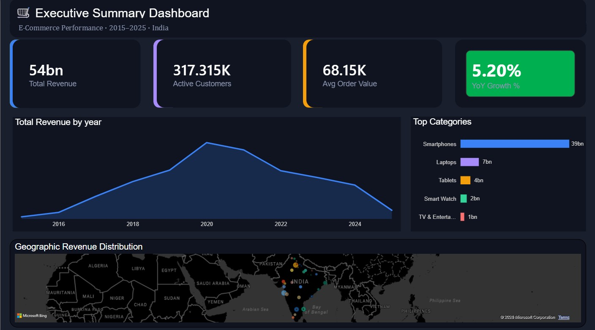
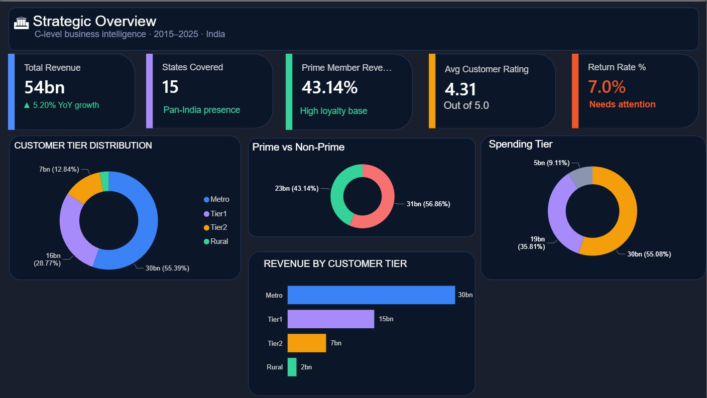

# Amazon India E-Commerce Analytics Dashboard

## Project Overview

Due to GitHub file size limitations, the Power BI & Clean CSV file is hosted on Google Drive.

https://drive.google.com/drive/folders/1ELRhk7P2LP6NO-B8faWOOzzUBgfsVQg7?usp=drive_link

This project analyzes 10 years (2015-2025) of Amazon India transactional data to generate business insights using Power BI, SQL, and Python.

## Business Objectives

- Revenue Trend Analysis
- Customer Segmentation
- Geographic Performance
- Festival Sales Analysis
- Payment Method Evolution
- Delivery Performance Analysis
- Return Rate Optimization

## Tools Used

- Python
- Pandas
- matplotlib
- seaborn
- SQL
- Power BI

## Dataset

- 1 Million+ Transactions
- 2000+ Products
- 10 Years Historical Data

## Dashboard Features

### Business Overview

### Delivery Analytics

### Executive Analytics

### Strategic Analytics

## Key Insights

- UPI became the dominant payment method after 2020.
- Prime customers generated higher average order values.
- Tier 2 cities showed the fastest growth.
- Electronics generated maximum revenue.

## Author

Ramesh krishna
